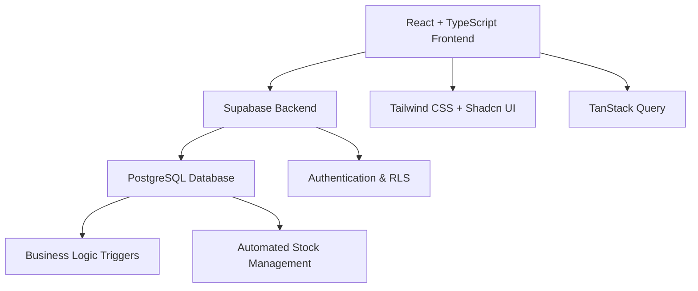
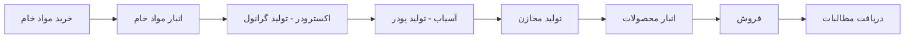

# 🏭 سیستم مدیریت شرکت رازمند - Razmand ERP

> **A comprehensive Persian RTL Enterprise Resource Planning system for plastic water-tank manufacturing**

[](https://opensource.org/licenses/MIT)
[](https://reactjs.org/)
[](https://www.typescriptlang.org/)
[](https://supabase.io/)
[](https://tailwindcss.com/)

## 📋 فهرست مطالب - Table of Contents

- [نمای کلی سیستم - System Overview](#-نمای-کلی-سیستم---system-overview)
- [ویژگی‌ها - Features](#-ویژگیها---features)
- [معماری سیستم - Architecture](#-معماری-سیستم---architecture)
- [نصب و راه‌اندازی - Installation](#-نصب-و-راهاندازی---installation)
- [استفاده - Usage](#-استفاده---usage)
- [مستندات - Documentation](#-مستندات---documentation)
- [مشارکت - Contributing](#-مشارکت---contributing)

## 🎯 نمای کلی سیستم - System Overview

سیستم مدیریت شرکت رازمند یک ERP جامع و کامل برای مدیریت شرکت‌های تولیدی مصنوعات پلاستیکی است. این سیستم تمامی فرآیندهای کسب‌وکار از خرید مواد اولیه تا فروش محصولات نهایی را پوشش می‌دهد.

**Razmand ERP** is a complete enterprise resource planning system designed specifically for plastic water-tank manufacturing companies. It covers all business processes from raw material procurement to final product sales.

## ✨ ویژگی‌ها - Features

### 📦 مدیریت انبار - Warehouse Management
- ✅ خرید و ثبت مواد خام - Raw material procurement
- ✅ مدیریت موجودی انبار - Inventory management
- ✅ سند خروج مواد خام - Material issue tracking
- ✅ ردیابی کامل مواد - Complete material traceability

### 🏭 مدیریت تولید - Production Management
- ✅ بخش اکسترودر - Extruder operations (گرانول production)
- ✅ بخش آسیاب - Mill operations (پودر production)
- ✅ تولید مخازن آب - Water tank manufacturing
- ✅ کنترل کیفیت - Quality control
- ✅ ردیابی تولید - Production tracking

### 💰 فروش و مالی - Sales & Finance
- ✅ فروش نقدی و اعتباری - Cash and credit sales
- ✅ مدیریت مطالبات - Receivables management
- ✅ مدیریت صندوق و بانک - Cash and bank management
- ✅ گزارشات مالی - Financial reporting
- ✅ گزارش سود و زیان - P&L statements

### 👥 منابع انسانی - Human Resources
- ✅ مدیریت کارکنان - Employee management
- ✅ حضور و غیاب - Attendance tracking
- ✅ محاسبه حقوق - Payroll calculations

### 📊 گزارشات - Reports
- ✅ گزارشات تولید - Production reports
- ✅ گزارشات موجودی - Inventory reports
- ✅ گزارشات فروش - Sales reports
- ✅ گزارشات مالی - Financial reports
- ✅ داشبورد مدیریتی - Executive dashboard

### 🔐 امنیت و دسترسی - Security & Access
- ✅ احراز هویت کامل - Complete authentication
- ✅ کنترل دسترسی مبتنی بر نقش - Role-based access control
- ✅ امنیت سطح ردیف - Row-level security (RLS)
- ✅ مدیریت کاربران - User management

### 🌐 ویژگی‌های فنی - Technical Features
- ✅ پشتیبانی کامل از RTL - Full RTL support
- ✅ تقویم جلالی - Solar Hijri (Jalali) calendar
- ✅ واحد پول افغانی - Afghan Afghani currency
- ✅ فونت Vazirmatn - Persian typography
- ✅ رابط کاربری ریسپانسیو - Responsive UI
- ✅ پشتیبانی از دستگاه‌های موبایل - Mobile support

## 🏗️ معماری سیستم - Architecture



### تکنولوژی‌های استفاده شده - Technology Stack

**Frontend:**
- ⚛️ React 18+ with TypeScript
- 🎨 Tailwind CSS + Shadcn/ui components
- 📊 TanStack Query for state management
- 🗓️ Dayjs + Jalaliday for date handling
- 📈 Recharts for data visualization
- 🔗 React Router for navigation

**Backend:**
- 🚀 Supabase (Backend-as-a-Service)
- 🐘 PostgreSQL with advanced features
- 🔒 Row Level Security (RLS)
- 🔄 Real-time subscriptions
- 📁 File storage

**DevOps:**
- 📦 Vite for build tooling
- 🧪 Vitest for testing
- 📋 ESLint + Prettier for code quality
- 🔧 GitHub Actions for CI/CD

## 🚀 نصب و راه‌اندازی - Installation

### پیش‌نیازها - Prerequisites

```bash
node >= 18.0.0
npm >= 8.0.0
# یا - or
yarn >= 1.22.0
```

### مراحل نصب - Installation Steps

1. **کلون کردن پروژه - Clone the repository:**
```bash
git clone https://github.com/Msherzai522/razmand-erp.git
cd razmand-erp
```

2. **نصب وابستگی‌ها - Install dependencies:**
```bash
npm install
# یا - or
yarn install
```

3. **تنظیم متغیرهای محیطی - Environment setup:**
```bash
cp .env.example .env.local
# ویرایش فایل .env.local و تنظیم متغیرهای Supabase
# Edit .env.local and configure Supabase variables
```

4. **راه‌اندازی پایگاه داده - Database setup:**
```bash
# اجرای migration ها
# Run migrations
npm run db:migrate

# اضافه کردن داده‌های نمونه (اختیاری)
# Seed sample data (optional)
npm run db:seed
```

5. **اجرای پروژه - Run the project:**
```bash
npm run dev
# یا - or
yarn dev
```

6. **دسترسی به سیستم - Access the system:**
```
http://localhost:5173
```

## 📖 استفاده - Usage

### ورود به سیستم - Login

1. اولین کاربر به‌صورت خودکار ادمین می‌شود
2. کاربران بعدی باید توسط ادمین دعوت شوند
3. نقش‌های مختلف: `admin`, `warehouse`, `production`, `sales`, `accountant`, `hr`, `viewer`

*First registered user automatically becomes admin. Other users must be invited by admin with specific roles.*

### گردش کار اصلی - Main Workflow



## 📚 مستندات - Documentation

- [📋 راهنمای نصب کامل](./docs/installation.md) - Complete Installation Guide
- [🏗️ معماری سیستم](./docs/architecture.md) - System Architecture
- [💾 مستندات پایگاه داده](./docs/database.md) - Database Documentation
- [🔌 مستندات API](./docs/api.md) - API Documentation
- [👨‍💻 راهنمای توسعه‌دهندگان](./docs/development.md) - Development Guide
- [🔐 مدیریت امنیت](./docs/security.md) - Security Management
- [📊 راهنمای گزارشات](./docs/reports.md) - Reports Guide
- [🎨 راهنمای طراحی UI](./docs/ui-guidelines.md) - UI Design Guidelines

## 🤝 مشارکت - Contributing

1. **Fork کردن پروژه**
2. **ایجاد branch جدید**: `git checkout -b feature/amazing-feature`
3. **Commit کردن تغییرات**: `git commit -m 'Add amazing feature'`
4. **Push کردن branch**: `git push origin feature/amazing-feature`
5. **ایجاد Pull Request**

### استانداردهای کد - Code Standards
- استفاده از TypeScript برای type safety
- پیروی از ESLint و Prettier rules
- نوشتن tests برای کامپوننت‌های جدید
- مستندسازی کامل

## 📄 مجوز - License

This project is licensed under the MIT License - see the [LICENSE](LICENSE) file for details.

## 👥 تیم توسعه - Development Team

**ASQA Group** - Digital Transformation Specialists
- 🌍 Location: Kabul, Afghanistan
- 📧 Contact: [asqa-groups@github.com](mailto:asqa-groups@github.com)
- 🔗 GitHub: [@Msherzai522](https://github.com/Msherzai522)

## 🙏 تشکر - Acknowledgments

- Thanks to the Supabase team for the excellent BaaS platform
- React and TypeScript communities
- Tailwind CSS and Shadcn/ui for beautiful components
- Persian/Farsi web development community

---

**Made with ❤️ in Afghanistan 🇦🇫**

*"Empowering Afghan businesses through digital transformation"*